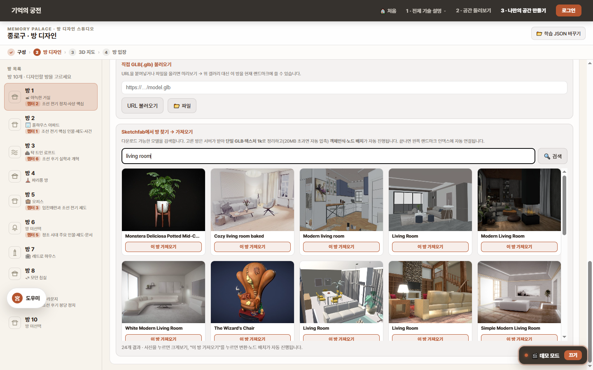

<div align="center">

# 🏛️ 기억의 궁전 · MIND PALACE

### ✨ 자료의 의미 구조를, 걸어다닐 수 있는 3D 공간으로 — Azure AI 기반 공간 기억 학습 서비스 「회랑」


🔗 **[라이브 데모](https://3d-mindpalace-ai-fxf8dyfqega3hvbp.canadacentral-01.azurewebsites.net/)** &nbsp;·&nbsp; `MS AI School 9기 · 3차 프로젝트` &nbsp;·&nbsp; 팀 **고민중독**

</div>

<a id="overview"></a>

## ✨ Overview

<!-- 스크린샷: 라이브 앱 메인/3D 워크스루 화면 -->

기억의 궁전(회랑)은 학습 자료(PDF·노트)를 **걸어다닐 수 있는 3D 기억의 궁전**으로 자동 변환하는 Azure AI 기반 공간 기억 학습 서비스입니다.

사용자가 자료를 올리면, AI가 개념과 관계를 추출해 **GraphRAG 지식그래프**로 구조화하고, 의미가 가까운 개념끼리 '방'으로 묶습니다. 그 방들은 VWorld 3D 지도 위 명소로 떠오르고, 입장하면 가구마다 학습 개념이 배치된 방 내부로 들어갑니다. 사용자는 공간을 **1인칭으로 걸으며 외우고**, 간격 반복으로 복습하며, 챗봇·퀴즈로 근거 기반 확인을 합니다.

핵심은 "AI가 궁전을 만든다"가 아니라 **"공간 구조 자체가 개념의 의미 구조에서 나온다"** 는 데 있습니다. PDF 전처리 → GraphRAG → 3D 공간 생성 → 학습·복습까지 하나의 흐름으로 이어지며, 모든 단계는 책임 있는 AI 6원칙으로 점검했습니다.

<a id="contents"></a>

## 📌 Contents

- [🎯 Problem](#problem)
- [🧭 Project Background](#project-background)
- [💼 Business Impact](#business-impact)
- [🚀 Key Features](#key-features)
- [🎛️ Functional UI & UX](#functional-ui-ux)
- [🖼️ UI/UX 갤러리 — 화면별 의도](#ui-gallery)
- [🏗️ Architecture](#architecture)
- [🧰 Tech Stack](#tech-stack)
- [📁 Folder Structure](#folder-structure)
- [📊 Data & Metrics](#data-and-metrics)
- [👥 Team](#team)
- [🧩 Contributions](#contributions)
- [🤝 Responsible AI](#responsible-ai)
- [🗺️ Roadmap](#roadmap)

<a id="problem"></a>

## 🎯 Problem

사람의 뇌는 '목록'을 그대로 기억하도록 설계되지 않았습니다. 여러 번 읽어도 금세 잊는 이유는 기억이 사라져서가 아니라, **다시 꺼낼 '인출 단서'가 없는 상태**이기 때문입니다 — "분명히 봤는데 안 떠오른다".

`제32조 제1항`, `임진왜란 1592`, `영단어 37개`처럼 평면적인 목록에는 위치 정보가 없어 인출 단서가 빈약합니다. 방대한 분량을 통째로 외워야 하는 학습(수험·자격증·전문 용어)일수록 단순 반복은 비효율적이고, 이건 **의지의 문제가 아니라 방법의 문제**입니다.

<a id="project-background"></a>

## 🧭 Project Background

**기억의 궁전(method of loci)** 은 정보에 '위치'를 부여해 경로를 따라 회상하는 고전 기억술입니다. 효과는 신경과학으로 입증됐지만, 정작 쓰기 어렵다는 데 문제가 있습니다 — 효과를 보려면 **분류 → 단서화 → 배치 → 반복**을 사용자가 직접 설계해야 하고, 이 설계 자체가 또 하나의 공부이기 때문입니다.

> **회랑의 약속:** 암기를 대신 해주지는 않습니다. 대신 **궁전 설계의 부담을 AI가 집니다.** 사용자는 외우고 복습하는 데만 집중합니다.

### 🔍 Why Spatial Memory Works

| Icon | 근거 | 내용 |
| --- | --- | --- |
| 🏅 | 공간 기억의 신경 기반 | 2014 노벨 생리의학상(O'Keefe·Moser) — 장소·격자 세포로 '어디에 있었나'가 오래 남음이 정립 |
| 🧠 | 단서의존 인출 | Tulving & Thomson 1973 — 기억은 사라진 게 아니라 인출 '단서'가 있어야 떠오른다 |
| 📈 | 일반인도 6주 만에 2배 | Dresler et al., *Neuron*(2017) — 하루 30분·6주 훈련으로 무작위 단어 회상 **26 → 62개(+138%)**, 4개월 뒤에도 유지, 뇌 연결망도 챔피언과 닮아감 |
| 🔁 | 간격 반복의 효과 | Cepeda et al. 2006 메타분석(184편·317실험) — 분산 학습이 몰아치기보다 장기 기억에 일관되게 유리 |

### 🧨 Pain Points

| Icon | 문제 | 설명 |
| --- | --- | --- |
| 🧩 | 설계 부담 | 개념을 의미 단위로 나누고, 시각 단서로 바꾸고, 공간에 배치하는 일을 사용자가 직접 해야 함 |
| ⏱️ | 진입 장벽 | 그 설계에 노력·훈련이 필요해, 정작 도움이 가장 필요한 학습자일수록 손대기 어려움 |
| 📄 | 평면적 자료 | PDF·노트는 위치 정보가 없는 목록이라 인출 단서가 빈약 |
| 🔁 | 비효율적 복습 | 몰아서 외우면 금방 잊고, 무엇을 언제 복습할지 스스로 관리하기 어려움 |

<a id="business-impact"></a>

## 💼 Business Impact

회랑은 단순 암기 앱이 아니라 **'기억 효율'을 개선하는 학습 인프라**를 목표로 합니다. 자료의 의미 구조를 공간 구조로 번역하고, 그 효과를 검증하는 데 핵심 가치가 있습니다.

### 📌 Market Opportunity

| Icon | 시장 근거 | 내용 |
| --- | --- | --- |
| 💰 | 거대한 사교육 시장 | 2024 초·중·고 사교육비 **29.2조원** (통계청, 4년 연속 역대 최고) — '암기 앱'이 아닌 '기억 효율' 개선 시장 |
| 🧠 | 검증된 확장 경로 | '학생 → 자격증·전문 시장' 확장은 듀오링고·뤼이드 등에서 검증된 경로 |
| 📚 | 방대·고비용 학습 수요 | 국가고시·전문 자격증 등 분량이 크고 실패 비용이 큰 학습일수록 효율적 기억술 수요가 큼 |

### 🎯 Target Users

| Icon | 단계 | 대상 | 효용 |
| --- | --- | --- | --- |
| 🎓 | **NOW** | 암기 과목 수험생 (중·고·대학생 / 한국사·탐구·영단어) | 단순 반복으로 버거운 분량을 공간 단서로 |
| 📜 | **NEXT** | 자격증·공무원 (법령·이론 통암기) | 실패 비용이 큰 통암기를 구조화 |
| 🏢 | **LATER** | 기업 교육 (B2B 교육·훈련) | 같은 엔진으로 고ARPU 시장까지 |

### 🧩 Product Positioning (moat)

"AI가 텍스트를 기억의 궁전으로 바꾼다"는 컨셉은 이미 존재합니다. 우리 자리는 **"공간 구조 자체가 개념의 의미 구조에서 나온다"** 는 데 있습니다.

| 기능 | 회랑 | Anki·SRS | Palace Walk(수동) | AI 생성형 | Topos(AR) | 구분 |
| --- | :---: | :---: | :---: | :---: | :---: | --- |
| 간격 반복 복습 | ✅ | ✅ | △ | △ | ✅ | 커머디티 |
| AI 시각 단서 자동 생성 | ✅ | ✗ | ✗ 수동 | ✅ | ✗ 수동 | 커머디티 |
| 자료 → 궁전 자동 생성 | ✅ | ✗ | ✗ | ✅ | ✗ | 커머디티 |
| **의미 클러스터링 기반 방 구조** | ✅ | ✗ | ✗ | ✗ 선형 | ✗ | **moat** |
| **임베딩 거리 기반 방 배치** | ✅ | ✗ | ✗ | ✗ | ✗ | **moat** |
| **기억 간섭 회피 배치** | ✅ | ✗ | ✗ | ✗ | ✗ | **moat** |

### 💰 Monetization

| 단계 | 모델 | 설명 |
| --- | --- | --- |
| B2C · 진입 | 학생 무료 → 유료 | 무료로 익히다 핵심 수험 구간에서 전환 |
| B2B2C · 핵심 | 학교·학원 라이선스 | 좌석 단위로 학생들이 함께 사용 |
| 확장 | 자격증·공무원·기업 | 같은 엔진으로 고ARPU 시장 (land & expand) |

<a id="key-features"></a>

## 🚀 Key Features

| Icon | 기능 | 설명 | 역할 |
| --- | --- | --- | --- |
| 📥 | 자료 → 개념·관계 분석 | 텍스트·PDF를 넣으면 AI가 개념·타입·관계(경량 온톨로지)를 추출하고 임베딩 | 입력 이해 |
| 🏗️ | 공간 자동 생성 | GraphRAG 구조로 방·복도를 잡고, 클러스터링이 검증·정제, 차원 축소로 배치. 각 개념을 시각 단서로 | 핵심 가치 |
| ✍️ | 사용자 편집 (HITL) | 방·개념을 드래그로 옮기고 단서를 고침. 그 수정은 모델 제약으로 환류 | 신뢰성·책임성 |
| 🚶 | 탐험 + 복습 | 궁전을 1인칭으로 걸으며 외우고, 간격 반복으로 회상 테스트·복습 | 학습·인출 |
| 💬 | 학습 챗봇 | 근거 있을 때만 답하는 RAG 챗봇 (출처 표시·근거 없으면 거절) | 보조 학습 |
| 📝 | 퀴즈 | GraphRAG 근거로 출제 → LLM 생성 → 근거 일치 2단 검증 | 인출 강화 |

<a id="functional-ui-ux"></a>

## 🎛️ Functional UI & UX

업로드 한 번이면 2D 설계도 → 3D 워크스루 → 간격 복습 → 챗봇·퀴즈가 하나의 흐름으로 연결됩니다.

### 🧭 UI Flow

| Step | 화면 | 핵심 기능 | 사용자 가치 |
| --- | --- | --- | --- |
| 01 | 메인·창구 챗봇 | 서비스 설명, PDF 제출 유도, 처리 과정 표시 | 목적을 빠르게 이해하고 자료 제출 |
| 02 | 도시 3D 지도 | VWorld 위 명소 마커 선택 → 입장 | 학습 공간 선택 |
| 03 | 2D 설계도 | 방·개념 전체 구조 한눈에 | 전체 지도 파악 |
| 04 | 3D 워크스루 | 1인칭 WASD로 방을 걸으며 마커 학습 | 동선이 곧 기억의 순서 |
| 05 | 간격 복습 | 잊을 때쯤 다시 회상 테스트 | 장기 기억 유지 |
| 06 | 챗봇·퀴즈 | 근거 기반 질의응답·출제 | 인출 강화·확인 |

> **인터랙티브 기술 설명:** [`/legacy/bounding-box-visual.html`](frontend/public/legacy/bounding-box-visual.html)(3D 워크스루 10스텝) · [`/legacy/how-it-all-works.html`](frontend/public/legacy/how-it-all-works.html)(글) · [`/legacy/pipeline-overview.html`](frontend/public/legacy/pipeline-overview.html)(한 장 요약)

<a id="ui-gallery"></a>

## 🖼️ UI/UX 갤러리 — 화면별 의도

> 라이브 데모에서 직접 캡처한 **실제 화면**입니다. 단순 페이지뿐 아니라 **버튼을 누르거나 마커를 클릭했을 때 등 구현된 상호작용 상태**까지 담았습니다(총 30장). 각 토글을 열면 화면과 **그 화면에 담은 UI/UX 의도**가 나옵니다. (이미지 원본: [`docs/ui/`](docs/ui/))

### 🚪 입구 — 온보딩

<details>
<summary><b>🏠 홈 — 스크롤 한 줄로 설득하는 랜딩 (6개 섹션)</b></summary>

<br>

**① 히어로** — 결과물(3D 궁전)을 먼저 보여 "뭐 하는 서비스인가"를 0초에. CTA 2단(내 PDF로 시작하기 / 3D 둘러보기).


**② 문제 제기(PAS)** — "읽기만 한 기억은 오래 머물지 않습니다" + 망각 3카드. 솔루션 전에 고통을 먼저 호명.


**③ 챕터 허브** — 01 암기 원리 · 02 학술 논거 · 03 체험 순서로 점프.


**④ 여섯 걸음** — PDF 업로드 → AI 추출 → … → 학습까지 6단계를 카드로.


**⑤ FAQ** — 시작 직전 망설임(내 자료 안전?·무료?·정말 외워지나?)을 선제 차단.


**⑥ 엔딩 시네마틱** — 빛나는 궁전 포털 "환영합니다 — 첫 번째 방으로". 감정적 클로징 + 최종 CTA.


**의도.** klleon.io 레퍼런스를 해부해 "방문자의 의심을 스크롤 순서대로 제거"하는 설득 골격(히어로 → PAS 문제 → 학술 근거 → 체험 순서 → FAQ → CTA)을 우리 시적·한옥 정체성 위에 얹었다. 화려함이 아니라 "왜 이게 효과 있는지"를 단계적으로 납득시키는 흐름.

</details>

<details>
<summary><b>🗺 도시 선택 — 익숙한 도시를 기억의 무대로</b></summary>

<br>


**의도.** 기억의 궁전은 **익숙한 공간일수록 잘 붙는다.** 그래서 추상적 가상 공간 대신 사용자가 아는 실제 도시(종로·부산·인천·대구·대전…)를 카드로 고르게 했다. 사진 썸네일로 "여기에 내 지식을 얹는다"는 그림을 직관적으로 전달한다.

</details>

<details>
<summary><b>🧩 구성 — AI가 챕터마다 장소·방을 추천하고, 사용자가 고른다 (HITL)</b></summary>

<br>


**의도.** 업로드한 자료(데모: 한국사)를 **챕터 단위로 쪼개** 각 챕터에 어울리는 장소(광화문·경복궁…)와 방(거실·펜트하우스…)을 AI가 추천하되, **드롭다운으로 사용자가 바꿀 수 있게**(Human-in-the-Loop) 했다. 입장 전에 전체 구조를 한 번 확인·편집하는 단계 — "AI가 정해준 대로"가 아니라 "내가 기억할 수 있는 공간으로". PDF가 없어도 **데모 데이터로 전체 흐름**을 체험할 수 있다.

</details>

### 🏛️ 3D 공간 — 핵심 경험

<details>
<summary><b>🌏 3D 지도 — 실제 지형 위 명소 마커, 클릭하면 건물로 (4개 상태)</b></summary>

<br>

**① 종로 전체** — 위성 지형 위 10개 명소 마커 + 우측 방 정보 패널.


**② 랜드마크 클릭** — 창덕궁을 누르면 카메라가 그 건물로 줌인되고 우측 패널이 갱신.


**③ 전체 보기** — 🔭 버튼으로 모든 명소가 한눈에 보이는 상공 조망.


**④ 다른 도시(경주)** — 같은 엔진, 도시만 교체(불국사·첨성대·석굴암).


**의도.** "장소의 순서 = 기억의 순서". 위치 관계가 분명한 실제 랜드마크에 방을 걸고, **마커 클릭 → 건물 줌인 → 입장**으로 공간 감각을 잃지 않게 했다. 전국 랜드마크 좌표를 정밀화해 자기에게 가장 익숙한 도시를 무대로 고를 수 있다.

</details>

<details>
<summary><b>🚶 1인칭 워크스루 — 방을 걸으며 외운다 (4개 상태)</b></summary>

<br>

**① 방 내부** — WASD로 걷고, 가구마다 번호 핫스팟 ①②③를 동선 순서대로.


**② 2D 개념 지도** — 사물·개념의 실제 배치를 위에서, 입장 시점(빨강)·연결(점선)까지.


**③ 방 이동** — 다른 랜드마크 방으로 바로 점프하는 드롭다운.


**④ 인식 가구 목록** — AI가 인식한 가구 9개(의자·조명·수납장·항아리…)를 리스트로.


**의도.** 제품의 심장. 동선 선·번호는 입장 시점 **부채꼴 시야 기준**(장소법)으로 매겨진다. 2D 개념 지도로 "전체 배치"를, 1인칭으로 "걷는 기억"을 둘 다 제공하고, 좌측 패널·미니맵으로 길을 잃지 않게 했다.

</details>

<details>
<summary><b>🎨 방 디자인 스튜디오 — 프리셋·자동 학습 매칭·Sketchfab 가져오기 (3개 상태)</b></summary>

<br>

**① 방 프리셋 갤러리** — 거실·주방·교실·사무실… 방마다 챕터를 배정.


**② 자동 매칭된 학습 내용** — 고른 방에 챕터 개념 14개(농사직설·사림·훈구·연산군…)가 자동 배정, 카드로 확인·순서 편집.


**③ Sketchfab 검색·가져오기** — 키워드로 다운로드 가능한 3D 방을 검색 → '가져오기'하면 서버가 받아 **단일 GLB·텍스처 1k로 정리(20MB↑ 자동 압축) → 객체인식·노드 배치까지 자동**. 프리셋에 없는 방도 끌어들이는 확장 경로.


**의도.** 익숙한 공간일수록 암기가 잘 되므로 "내 공간"을 고르게 하고, AI가 **챕터 → 방 → 개념을 자동 매칭**하되 사용자가 점검·수정(HITL). 외부(Sketchfab) 임포트 경로는 **Zip Bomb·SSRF·이미지 디컴프레션 폭탄**까지 막아 안전하게 처리한다(보안: 효석).

</details>

<details>
<summary><b>🤖 방 스캐너 — 어떤 3D 방이든 브라우저에서 AI가 가구를 인식</b></summary>

<br>


**의도.** 핵심 기술(GLB 방 → 가구 인식 → 레이캐스트 → 핫스팟 자동 배치)을 **사용자가 직접 GLB를 넣어** 돌려볼 수 있는 도구. 추론은 전부 **브라우저에서**(서버리스) 일어난다 — 프리셋에 없는 방도 끌어들일 수 있다는 확장성의 증거.

</details>

### 🧭 공통 UI — 모든 페이지에서

<details>
<summary><b>🧭 통일 내비 · 💬 도우미 챗봇 · 📝 퀴즈 (3개)</b></summary>

<br>

**① 통일 내비 드롭다운** — 모든 페이지 상단 "전체 기술 설명"에 글/3D 워크스루를 한데 모음.


**② 도우미 챗봇** — 어디서든 떠 있는 안내 도우미(퀴즈 만들기·화면 이동·공간 안내·음성 입력).


**③ 퀴즈 설정** — 주제·문제 수(3/5/10)·유형(객관식/OX/단답)을 고르면 GraphRAG 근거로 출제.


**의도.** 페이지가 많아 길을 잃기 쉬운 구조라, 상단 통일 내비·플로팅 도우미·인룸 퀴즈를 **전 페이지 공통**으로 깔아 일관된 길잡이를 줬다.

</details>

### 👤 계정

<details>
<summary><b>👤 마이페이지 — Microsoft(Entra) 로그인, 내 서재 저장</b></summary>

<br>


**의도.** 만든 궁전을 **계정에 저장**해 재접속해도 그대로 이어가게 한다. 로그인은 Google에서 **Microsoft(Entra)** 로 전환했고(엔터프라이즈 친화), 사용자별로 데이터를 격리 저장한다. 캡처는 로그아웃 상태의 로그인 게이트.

</details>

### 🔬 기술 설명 — 신뢰·투명성

<details>
<summary><b>📖 전체 기술, 한 페이지로 — 어려운 기술을 쉬운 말 + 토글로</b></summary>

<br>


**의도.** 심사·발표에서 **비전공자도** 전체 파이프라인을 따라오게, 모든 단계를 쉬운 말로 풀고 **목차 칩으로 점프**하게 했다. 깊은 내용은 토글(자세한 기술·근거 보기)로 접어 "쉬운 한 줄 먼저, 자세한 건 누르면" 구조 — 정보량이 많아도 안 질리게.

</details>

<details>
<summary><b>🧊 3D 워크스루 (10스텝) — 실제 작업을 3D로 슥슥 넘기며 설명</b></summary>

<br>


**의도.** 바운딩박스·세그멘테이션·레이캐스트·동선·카메라를 **글이 아니라 실제 3D 방을 돌려가며** 10스텝으로 설명하는 인터랙티브 페이지. 각 시각화는 추상 도식이 아니라 **실제 파이프라인이 쓰는 그 값**(정규화 7.2·핫스팟·황금각 등)을 그대로 그린다 — 정확도가 곧 설득력.

</details>

<details>
<summary><b>📍 마커가 생기는 7단계 — 방 → 가구 인식 → 번호</b></summary>

<br>


**의도.** "3D 방을 넣으면 어떻게 학습 마커가 생기나"를 7단계(크기 맞추기 → 사물 찾기 → 이름 짓기 → 겹침 정리 → 걷는 순서 → 자리 잡기 → 카메라)로 분해. 도식 + 단계별 실제 수치로 "마법이 아니라 공정"임을 보여준다.

</details>

<details>
<summary><b>🧭 동선은 어떻게 설계될까 — 부채꼴 시야 기준 한 바퀴</b></summary>

<br>


**의도.** 번호를 아무렇게나 매기지 않는다는 걸 시각화. **입장 시점에서 보이는 부채꼴 시야**를 기준으로, 모서리를 골고루 거치며 한 바퀴 매끄럽게 도는 순서를 설계한다. 동선이 자연스러워야 "걸으며 외우기"가 성립하기 때문.

</details>

<details>
<summary><b>🏗️ 런타임 아키텍처 — 별도 모듈(PDF→GraphRAG) + 우리 구현 3D 7단계</b></summary>

<br>


**의도.** 전체 시스템을 한 장의 흐름도로. 위쪽은 데이터·의미 구조(PDF 전처리 → GraphRAG → palace.json), 아래 강조 박스는 **우리가 직접 구현한 3D 마커 파이프라인 7단계**와 그 안에서 Azure Vision·GPT-4.1이 어디에 쓰이는지를 색으로 구분해 보여준다.

</details>

<details>
<summary><b>📈 한 장으로 보는 전체 과정 — 가로 스크롤 한 줄 요약</b></summary>

<br>


**의도.** 방 입력부터 학습·저장까지를 **가로 스크롤 카드 한 줄**로 압축. 중복 없이 깔끔한 순서로, "전체가 어떻게 이어지는지"만 빠르게 훑게 한 발표용 한 장.

</details>

> 참고: 일부 페이지(`memory-walk`·`personal-room-scanner-3d`)는 라이브에서 기본 방 GLB가 미배포(404)라 **존재하는 방 GLB를 지정해** 캡처했고, `mypage`는 로그인 게이트 상태입니다. `vworld_landmarks`는 `vworld_map?city=jongno`로의 별칭이라 별도 캡처를 생략했습니다.

---

<a id="architecture"></a>

## 🏗️ Architecture

업로드 → **전처리 → GraphRAG → 3D 공간 → 복습**, 한 흐름.

### ① PDF 전처리 — 성격에 맞춰 경로 분기

| 갈래 | 처리 | 비고 |
| --- | --- | --- |
| 디지털 PDF | `PyMuPDF`로 텍스트·이미지 객체 로컬 추출 | 빠름·무료, 구조 분리·후처리 생략 |
| 스캔 PDF | `PaddleOCR + Ko-pii` PII 마스킹 → **Azure Content Understanding**(텍스트·레이아웃 마크다운) → `<figure>` 분리 → **DocLayout-YOLO** 미탐 이미지 재검출 | 면적비 게이트로 잡동사니 제외 |
| 공통 | 개인정보 후처리(ko-pii 재검사) → LLM 정제·캡션·목차 | 목차가 방 배치의 기반 |

- *트러블슈팅:* OCR 후보(Docling·MinerU·PyMuPDF) 직접 비교 → 한국어·구조 정확도로 **Content Understanding** 채택. 스캔본의 **한글→특수기호 오인식**(한글 특화 OCR 검토), **페이지 전체가 1개 이미지로 잡히는** 오인식(DocLayout-YOLO 재분리)이 핵심 난관이었음.

### ② GraphRAG — 개념·관계 구조화

- 일반 RAG의 약점(흩어진 정보·전체 흐름)을 **개체·관계 지식그래프**로 보완.
- 인덱싱 4단계: 청킹(TextUnit) → 엔티티·관계 추출 → **Leiden 군집화** → community report. 산출물 6개 `.parquet`.
- 목차로 방 경계 고정 → 개념을 첫 등장 위치의 방에 배치 → 루브릭 keep/demote → **방 개수(K) 자동화**(작은 방은 옆 방에 합침) → 이미지를 캡션 임베딩 유사도로 매칭.
- 학습 챗봇 **RAG 라우팅**(global↔local 폴백, 근거 없으면 거절 — 답변 질로 **global 채택, 약 7–8초**), 퀴즈 **2단 검증**.

### ③ 3D 엔진 — 공간

- **VWorld 국가 3D 지도** 위 명소 마커 → '입장' → 방 내부 전환. (84개 도시 좌표를 카카오맵 재지오코딩 + '이름 일치·도심 거리' 거름망으로 정밀화)
- 방 내부: GLB 방을 받아 **가구 인식 → AABB 중심 3D 좌표 → 걷는 동선 번호 → 학습 개념 배치(장소법)**.
- 상세 알고리즘: **[ARCHITECTURE.md](ARCHITECTURE.md)** (좌표계 정규화·검출 게이트·세그멘테이션·삼각측량·동선·카메라).


### ④ UI/UX · 복습

- **2D 설계도 · 3D 워크스루 · 간격 복습 · 챗봇·퀴즈**를 한 흐름으로.
- 접근성: Azure 음성 + **공간음향(HRTF)**, 읽기 속도·글자 크기·테마, 저사양 모드.

<a id="tech-stack"></a>

## 🧰 Tech Stack

| 영역 | 기술 |
| --- | --- |
| **AI · LLM** | Azure OpenAI (GPT-4.1) · text-embedding-3-small · Microsoft **GraphRAG** (Leiden community report) |
| **문서 전처리** | PyMuPDF · Azure Content Understanding · PaddleOCR + Ko-pii(PII) · DocLayout-YOLO |
| **3D 엔진** | Three.js (GLTFLoader+DRACO) · VWorld 3D 지도 · 카카오맵 Geocoding · Azure AI Vision(스캐너) |
| **음성·접근성** | Azure Speech(TTS/STT) · 공간음향(HRTF) |
| **백엔드** | FastAPI · Cosmos/Blob(사용자 격리 저장) |
| **프론트엔드** | Vite · Vanilla JS / legacy HTML |
| **인프라** | Azure App Service · Azure Safety Filter |

<a id="folder-structure"></a>

## 📁 Folder Structure

```
Mindpalace_Microsoft9ai_Thirdprj/
├─ backend/         FastAPI 서버 (app/, main.py, USER_DB.md)
├─ frontend/        Vite + src/
│  └─ public/legacy/  설명 페이지·3D 워크스루(bounding-box-visual)·방 스캐너·memory-walk
├─ tools/           fetch_city_photos.py (도시 사진 수집)
├─ ARCHITECTURE.md  3D 공간 마커 시스템 전체 아키텍처
├─ 3D-PIPELINE-TECHNICAL-SHARE.md · 3D-RECOGNITION-DEEPDIVE.md · HOTSPOT-3D-PIPELINE.md
├─ CONTRIBUTORS.md  팀 역할·사람별 히스토리
└─ deploy-build.ps1 / startup.sh / requirements.txt
```

```bash
# 백엔드
pip install -r requirements.txt   # Azure OpenAI/Vision 등은 환경변수 주입 → startup.sh
# 프론트
cd frontend && npm install && npm run dev
# 배포: Azure App Service (deploy-build.ps1)
```

<a id="data-and-metrics"></a>

## 📊 Data & Metrics

| Icon | 항목 | 값 |
| --- | --- | --- |
| ✅ | 검증 완료 과목 | 한국사 · AI 교안 · 경제 · 회계 감사 (그 외는 GraphRAG 자동 산정) |
| ⚡ | RAG 응답 시간 | global 서치 채택 기준 약 **7–8초** |
| 📄 | 처리 용량 | 현재 10MB · 50p 이내 (확대 예정) |
| 🧩 | 전처리 정제 예시 | 스캔 1페이지 → figure 19 재크롭 + 6 분리 = 25개 정제 |
| 📈 | 기억 효과 근거 | 6주 훈련 시 무작위 단어 회상 +138% (Dresler 2017) |

<a id="team"></a>

## 👥 Team

**고민중독** (MS AI School 9기) — 7인이 데이터 전처리부터 책임 있는 AI까지 전 과정을 분담.

| 이름 | 역할 |
| --- | --- |
| **오준상** | 3D 엔진 & UI/UX |
| **오효석** | 3D 엔진 및 보안 |
| **김시언** | UI 및 데이터 전처리 |
| **지경민** | 이미지 및 데이터 전처리 |
| **조윤재** | GraphRAG |
| **김인준** | GraphRAG |
| **이재모** | GraphRAG (초기 이미지 전처리) |

<a id="contributions"></a>

## 🧩 Contributions

| 이름 | 주요 기여 |
| --- | --- |
| 오준상 | VWorld 지도·방 입장, GLB 가구 인식·3D 좌표·동선·카메라(memory-walk), 기술 설명 페이지·통일 내비, 데모 흐름 |
| 오효석 | 프리셋·랜드마크 마커 적용, memory-walk 엔진, 보안(Stored XSS 방어) |
| 김시언 | 홈·챗봇·퀴즈 UI, TTS 공간음향(HRTF), 지도 UX, RAG 챗봇 연동 |
| 지경민 | MinerU 이미지·캡션 추출, 스캔 PDF 정제, "서기" 창구 챗봇, 전처리 파이프라인 |
| 조윤재 | AI 교안 테스트, 방 개수 K 자동화, 이미지 매칭, GraphRAG 인덱싱·라우팅 |
| 김인준 | AI 교안 테스트, GraphRAG 인덱싱·검색·요약, 퀴즈 근거 검증 |
| 이재모 | OpenCV 이미지 분리·캡션(초기) → GraphRAG 인덱싱·퀴즈 |

> 사람별 여정·Git 커밋·소감·타임라인 전체는 **[CONTRIBUTORS.md](CONTRIBUTORS.md)** 참조.

<a id="responsible-ai"></a>

## 🤝 Responsible AI

AI가 핵심인 서비스인 만큼 6대 원칙을 모두 점검했습니다.

| Icon | 원칙 | 적용 |
| --- | --- | --- |
| 🔍 | 투명성 | 진행 로그·토큰 사용량 공개 · 근거 없으면 챗봇 거절 · 퀴즈 근거 표시 |
| 🔒 | 개인정보·보안 | ko-pii 이중 차단 · 이미지 마스킹 · 사용자별 DB 파티션 · Zip Bomb/Slip·SSRF 방어 · HTML 이스케이프 |
| 🛡️ | 신뢰성·안전성 | 퀴즈 근거 재검증 · 결과 저장(재접속 동일) · 청크 스트리밍 업로드 · 레이트리밋 |
| ⚖️ | 공정성 | 전국 랜드마크 · Azure Safety Filter · RAG 품질 정량 평가(관련성·근거 충실성) |
| 🙋 | 책임성 | AI 한계 고지 · 노드명/배치 직접 수정 · 학습 항목 직접 결정 |
| ♿ | 포용성 | 음성·공간음향 · 스크린리더 접근성 · 글자 크기 · 저사양 모드 |

<a id="roadmap"></a>

## 🗺️ Roadmap

| 단계 | 방향 | 설명 |
| --- | --- | --- |
| 1 | 공간 개인화 | 현재는 라이선스 자유로운 프리셋 방(데이터셋·스케치팹·자동 생성은 라이선스·이중 로그인·품질로 막힘) → AR 내 방 스캔·자연어 방 생성·파노라마 배경 |
| 2 | 과목 다양성 | 데이터·사용자 피드백 누적으로 분석 정확도 향상 |
| 3 | 스캔 PDF 이미지 분리 | 명도·채도 유사 시 분리 실패 보완(전용 모델) |
| 4 | 처리 용량 확대 | 10MB·50p 한도 상향 |
| 5 | 플랫폼·포맷 확장 | 웹 → 앱, DOCX·HWP·녹음 지원 |
| ∞ | 확장 비전 | 기업 장비 매뉴얼 · 재난 대피 훈련 · 문화·관광 해설 — 암기가 필요한 모든 곳으로 |

---

<div align="center">

**자료의 의미 구조를, 걸을 수 있는 공간으로.**

</div>
